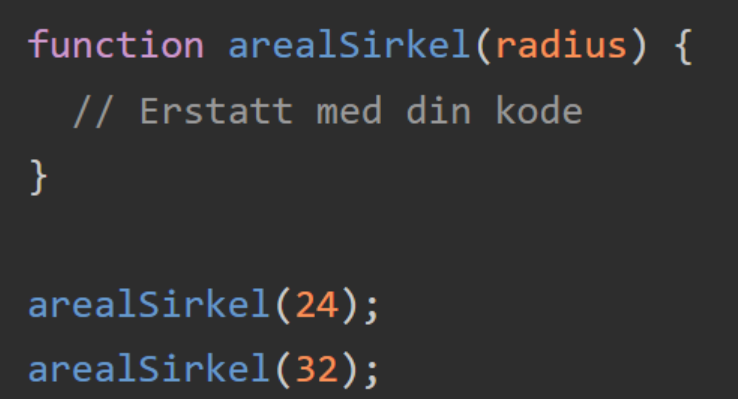
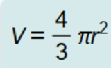
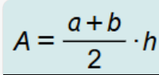

# JavaScript - Funksjoner: Oppgaver

Her er det fem oppgaver du kan velge i. Velg deg ut oppgaver du ønsker å jobbe med. Noen er litt vanskelig, mens andre er litt lettere. Prøv å utfordre deg selv!

## Oppgave 1

I denne oppgaven skal du fullføre funksjonen nedenfor slik at arealet til sirklene med radius 24 og 32 skrives til konsollen. Skriv en informativ tekst sammen med resultatet. Du får π i JavaScript ved å skrive Math. PI.s

## Oppgave 2

I denne oppgaven skal du lage funksjonen "volumKule" slik at volument av kulene med radius 11 og 21 skrives til konsollen. Skriv en informativ tekst sammen med resultatet. Formelen for volumet av en kule ser slik ut: .

## Opgave 3

Lag en funksjon som tar inn navn og alder. Hvis alder er under 30, skal funksjonen skrive ut "Hei navn, du er ung!". Hvis ikke alder er under 30 skal funksjonen skrive ut "Du er gammel!". Test med ulike navn og alder.

## Oppgave 4

### Oppgave 4a

Lag en funksjon som mottar et tall som parameter og returnerer kvadratet av tallet (altså tallet opphøyd i annen). Test funksjonen ved å skrive tekster på formen «Kvadratet av tall er resultat» til konsollen. NB! Funksjonen skal ikke inneholde noen tekst, den skal bare returnere resultatet.

### Oppgave 4b

Lag en funksjon som regner ut arealet av et trapes og returnerer resultatet. Test funksjonen med ulike verdier. Formelen for arealet av et trapes er 

## Oppgave 5

### Oppgave 5a

Lag to variabler tall1 og tall2 og en funksjon som bytter verdiene mellom de to tallene. Skriv ut tallene til konsollen før og etter at du bruker funksjon, slik: «tall1 = … og tall2 = …».

### Oppgave 5b

Lag en funksjon som tar tre tall som parametre. Hvis det første tallet ligger mellom de to andre tallene, skal funksjonen returnere true. Hvis ikke, skal den returnere false. Test funksjonen med forskjellige verdier og skriv ut resultatet i konsollen.

### Oppgave 5c

Skriv en funksjon som sjekker om et tall er et primtall. Et primtall er bare delelig med 1 og med seg selv. Hint: Bruk modulusoperatoren (%) for å sjekke om et tall er delelig med et annet.

### Oppgave 5d

Skriv en funksjon som sjekker om en tekst er et palindrom. Et palindrom er en tekst som gir resultat enten det leses fra venstre eller høyre. Nesen, Otto, regninger, rekker, rotor og Ada er eksempler på palindromer. Hint: Bruk en løkke som går gjennom en tekst og sjekker om første og siste bokstav er like, deretter andre og nest siste, osv. Det kan være lurt å sjekke om antall tegn i teksten er et partall eller et oddetall.